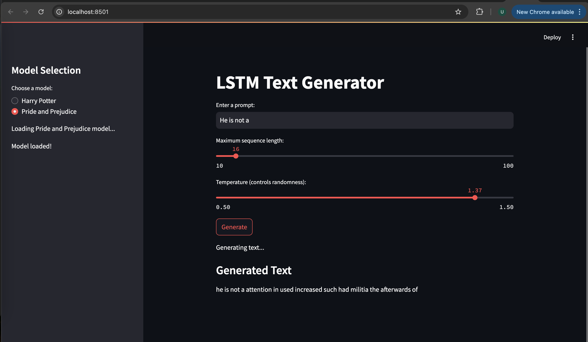
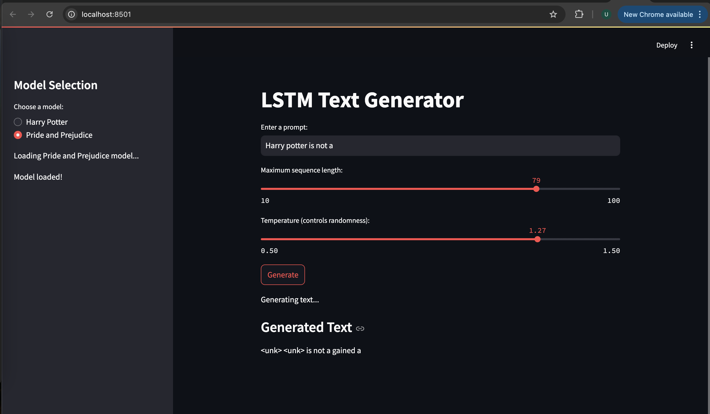
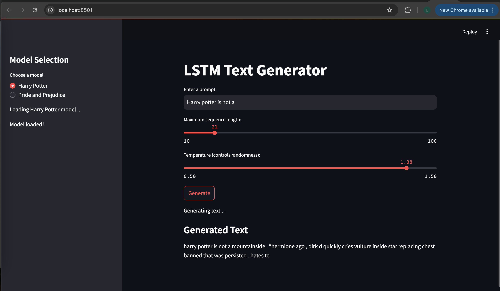
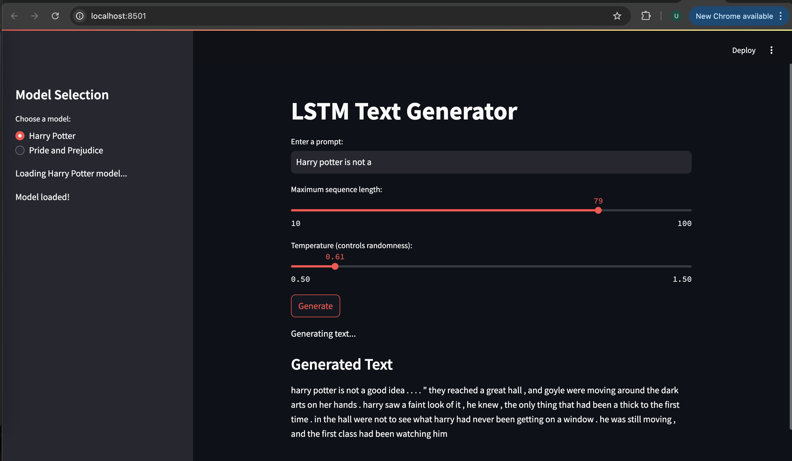
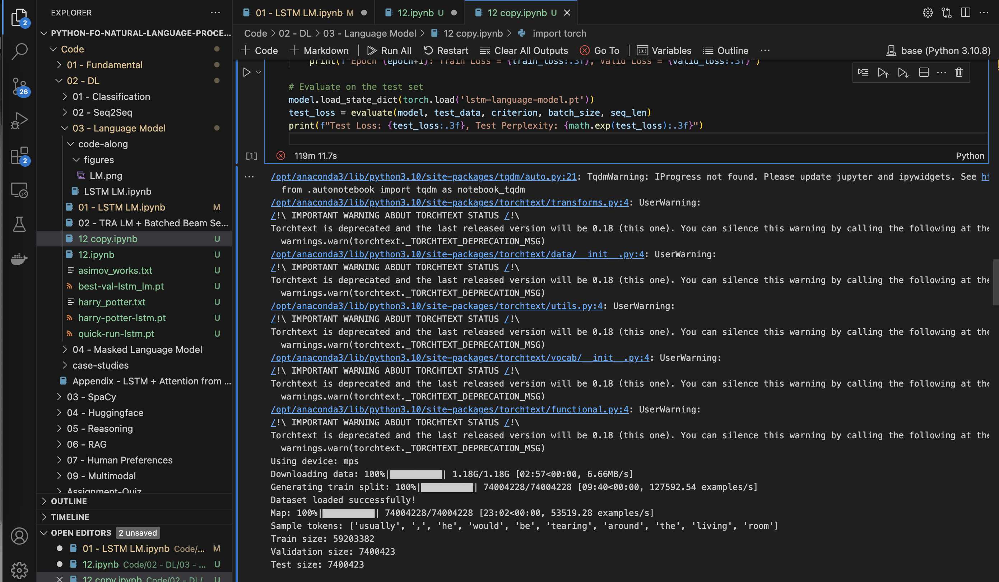
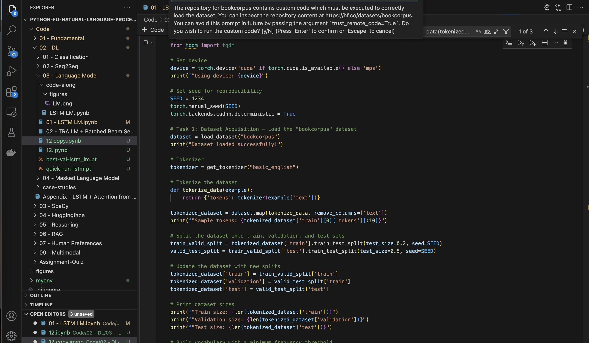

# LSTM-Based Language Model with Streamlit Interface

This project demonstrates an LSTM-based language model trained on two datasets, **Harry Potter** and **Pride and Prejudice**, and provides an interactive Streamlit application for generating text based on these models.

---

## 🚀 Features

- **Language Model**: Built using PyTorch's LSTM layer.
- **Text Generation**: Generate text using trained LSTM models with user-specified prompts and temperatures.
- **Streamlit Interface**: A user-friendly web application to interact with the models.
- **Multiple Models**: Toggle between Harry Potter and Pride and Prejudice models.

---

## 📂 Project Structure

- `app.py`: The main Streamlit application file.
- `harry_potter_lstm.pt`: Trained LSTM model for the Harry Potter dataset.
- `pride_prejudice_lstm.pt`: Trained LSTM model for the Pride and Prejudice dataset.

---

## ⚙️ Installation and Setup

1. **Clone the Repository**:
   ```bash
   https://github.com/usmankhalid-95/A2-LSTM-Text-Generator.git
   ```

2. **Run the Streamlit App**:
   ```bash
   streamlit run app.py
   ```

---

## 📚 Model Details

### **Architecture**
The model uses the following architecture:
- Embedding Dimension: `1024`
- Hidden Dimension: `1024`
- LSTM Layers: `2`
- Dropout Rate: `0.65`

The input text is tokenized, converted to embeddings, and passed through LSTM layers to predict the next word.

### **Training**
- **Datasets**:
  - **Harry Potter** dataset: Sourced from fan fiction content for creative purposes.
  - **Pride and Prejudice** dataset: Public domain text from Jane Austen's novel.
  
  **Note**: Ensure to use datasets ethically and comply with usage rights.
- **Parameters**:
  - Learning Rate: `1e-3`
  - Sequence Length: `35`
  - Gradient Clipping: `0.65`
  - Epochs: `5`

Models were trained using PyTorch and saved as `.pt` files for inference.

### **Training Details**

| **Model**              | **Epoch** | **Train Perplexity** | **Valid Perplexity** |
|------------------------|-----------|----------------------|----------------------|
| **Harry Potter**        | 1         | 116.361              | 76.047               |
|                        | 2         | 59.921               | 59.170               |
|                        | 3         | 44.194               | 53.581               |
|                        | 4         | 35.746               | 50.908               |
|                        | 5         | 30.293               | 49.395               |
| **Pride and Prejudice** | 1         | 161.777              | 95.817               |
|                        | 2         | 82.185               | 75.217               |
|                        | 3         | 64.598               | 67.632               |
|                        | 4         | 54.696               | 64.988               |
|                        | 5         | 48.182               | 66.149               |

---

## 🧑‍💻 Usage Instructions

1. **Select the Model**: Choose between the Harry Potter and Pride and Prejudice models.
2. **Enter a Prompt**: Provide a starting sentence for the model to generate text.
3. **Set Temperature**: Adjust the temperature to control the randomness of the generated text:
   - Lower values produce more deterministic outputs.
   - Higher values increase diversity in the output.
4. **Generate Text**: Click on the "Generate Text" button to see the output.

---

## 📸 Screenshots

Here are some screenshots of the Streamlit UI:

- **Tested Image 1**
  

- **Tested Image 2**
  

- **Tested Image 3**
  

- **Tested Image 4**
  

- **Tested Image 5**
  

- **Tested Image 6**
  

## 🔗 Dataset Credits
- **Pride and Prejudice**: The dataset is sourced from [Project Gutenberg](https://www.gutenberg.org/ebooks/1342), which provides free access to public domain books.
- **Harry Potter**: This dataset is available on Hugging Face, created by [elricwan](https://huggingface.co/datasets/elricwan/HarryPotter)